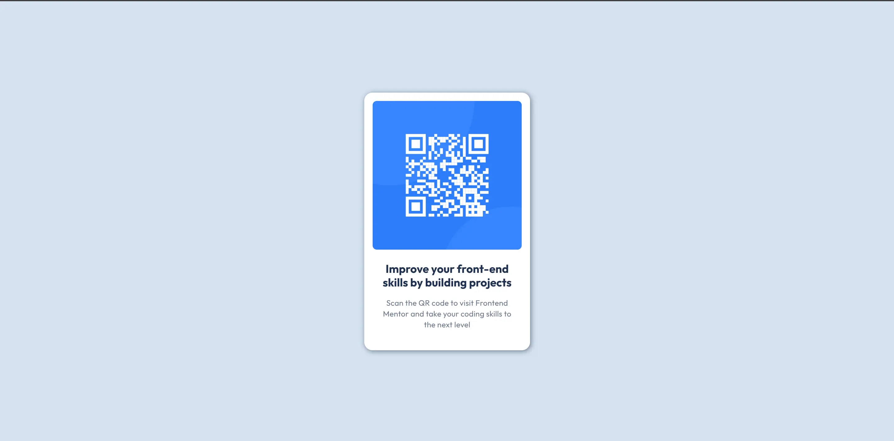

# Frontend Mentor - QR code component solution

This is a solution to the [QR code component challenge on Frontend Mentor](https://www.frontendmentor.io/challenges/qr-code-component-iux_sIO_H). Frontend Mentor challenges help you improve your coding skills by building realistic projects. 

## Table of contents

- [Overview](#overview)
  - [Screenshot](#screenshot)
- [My process](#my-process)
  - [Built with](#built-with)
  - [Useful resources](#useful-resources)

## Overview

### Screenshot

 

## My process

### Built with

- Semantic HTML5 markup
- CSS custom properties
- Flexbox
- CSS Grid
- Mobile-first workflow

### Useful resources

- [google-webfonts-helper](https://gwfh.mranftl.com/fonts) - This helped me for XYZ reason. I really liked this pattern and will use it going forward.
- [mdn](https://developer.mozilla.org/en-US/) - This is an amazing article which helped me finally understand XYZ. I'd recommend it to anyone still learning this concept.
- [markup validation service](https://validator.w3.org/) - This is an amazing article which helped me finally understand XYZ. I'd recommend it to anyone still learning this concept.
- [PageSpeed Insights](https://pagespeed.web.dev/) - This is an amazing article which helped me finally understand XYZ. I'd recommend it to anyone still learning this concept.
- [Squoosh](https://squoosh.app/) - This is an amazing article which helped me finally understand XYZ. I'd recommend it to anyone still learning this concept.

